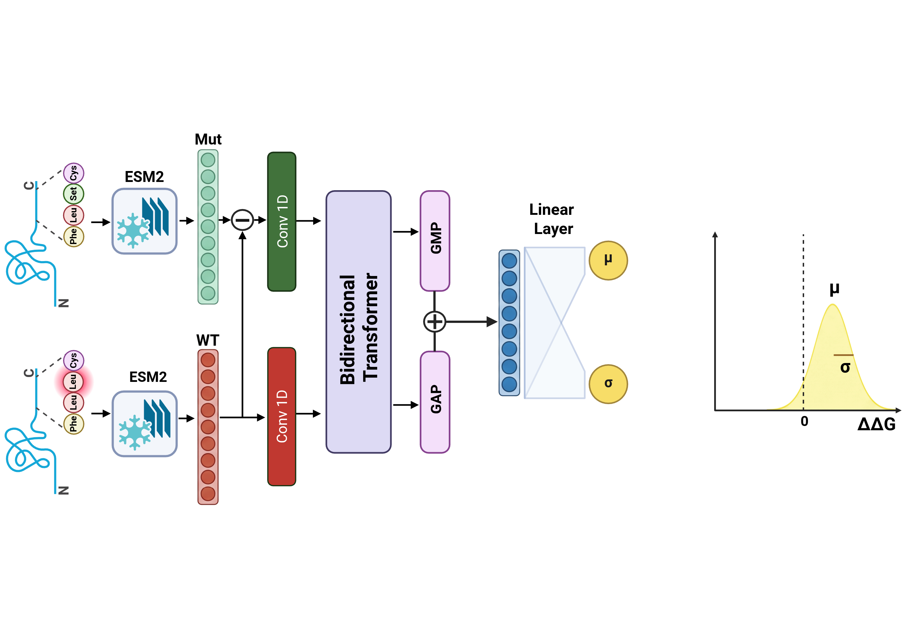

# ProbJanusDDG



Sequence-based prediction of mutation-induced changes in protein stability,
with median point predictions and protein-weighted standard/adaptive CV+ intervals.

## Installation

Use Python 3.12 and a CUDA GPU for training. Install a CUDA-enabled PyTorch build
appropriate for your hardware, and the remaining packages:

```bash
python -m venv .venv
source .venv/bin/activate
pip install -r requirements.txt
```

`requirements-reference.txt` records the package versions used by the archived
run. Different library versions, numerical kernels, or hardware can change
retrained models. CPU inference is available with `--device cpu`.

## Model and protocol

- Inputs are frozen full-length ESM2-650M embeddings, 1280 values per residue.
  No structures are required. The three included tables are S2450, S669L and S461L.
  Their original row order, full-sequence mappings, labels and five S2450 folds are preserved.
- Training uses direct model output, Gaussian NLL (`beta=0`), Adam at `1e-4`,
  batch size 6, and uniform mutation weights. Exact inverse examples swap WT/MUT
  and negate the target. Both mean and scale are trained.
- Each outer fold remains excluded from fitting and epoch selection. The next
  fold modulo five selects the epoch; the other three train an inner model.
  Selection minimizes the raw mean of within-protein MSEs over epochs 1–300,
  using antisymmetric predictions. Ties choose the earliest epoch.
- A fresh model is refitted on all four non-outer folds for the selected epoch
  count. Inner seeds are `10000+100*k`; refit seeds are `100*k` for seed 0.
  There is no model refitted on all five folds.
- Delivered mean is `(m(WT,MUT)-m(MUT,WT))/2`; scale is
  `softplus((s(WT,MUT)+s(MUT,WT))/2)+1e-3`. The point estimate is the median
  of the five fold means. The learned scale is not itself a calibrated interval.
- Each OOF score is paired with the SAME fold model's prediction on the new input.
  Standard scores use absolute error; adaptive scores divide it by the OOF scale,
  then multiply by that fold model's scale on the new input.
- Calibration assigns each WT protein total weight `1/P` and each mutation
  weight `1/(P*n_p)`. Interval endpoints are weighted empirical candidate quantiles
  at `1-coverage` and `coverage`, with no interpolation or finite-rank correction.
  The corrected mutation-weighted CV+ construction is retained as a comparison.


Protein weighting defines an empirical protein-balanced target; it does not by
itself establish a finite-sample hierarchical coverage guarantee. Calibration
requires representative proteins and comparable within-protein sampling for
transfer to the intended population. Report both mutation-level and equal-protein
coverage.

## Large assets


The original frozen embedding cache and five fold checkpoints are available on
[Zenodo](https://doi.org/10.5281/zenodo.23187754) under **CC BY 4.0**.
Download all seven files from the record, including all three embedding parts,
`checkpoints.zip` and `bundle.json`. `README.txt` documents the assets and
`SHA256SUMS` provides additional integrity checks.

To create an equivalent bundle from a local copy of the original assets:

```bash
python scripts/manage_assets.py pack --output dist/assets
```

The bundle contains three embedding parts of at most 1 GiB, `checkpoints.zip`,
and `bundle.json`. After downloading all bundle files into one directory:

```bash
python scripts/manage_assets.py restore /path/to/downloaded_bundle
python scripts/manage_assets.py verify
```

## Reproduce training and evaluation

From the repository root:

```bash
python pipeline/run.py --preflight
bash run.sh
```

To run detached, if GNU screen is installed:

```bash
screen -dmS ProbJanusDDG bash run.sh
tail -f pipeline/training.log
```

Fresh outputs go into `pipeline/`: selected epochs, checkpoint files, per-fold
OOF/test predictions, metrics and figures. Completed stages are verified by hash
and reused when restarting; an interrupted, incomplete fit restarts from its
initial seed. Protocol changes are rejected instead of mixing runs.

The compact archived outputs are in `reference/`; the five published epoch
counts are **57, 232, 126, 283, 105**. Regenerate their evaluation and figures
without any retraining:

```bash
python pipeline/evaluate.py --run-dir reference
PROBJANUS_RUN_DIR=reference python pipeline/plot_paper_figures.py
PROBJANUS_RUN_DIR=reference python pipeline/plot_interval_comparison.py --level 50
PROBJANUS_RUN_DIR=reference python pipeline/plot_coverage_switches.py --level 50
PROBJANUS_RUN_DIR=reference python pipeline/sign_exclusion/analyze.py
PROBJANUS_RUN_DIR=reference python pipeline/sign_exclusion/plot_summary.py
```

The main plot defaults to median aggregation and protein-weighted calibration.
Omit `PROBJANUS_RUN_DIR` to plot a newly trained run. Interval-example scripts
also support 90% nominal coverage; direction-call summaries cover 50–95%.

## Predict WT/mutant pairs

Input is CSV or parquet with full `wt_seq` and `mut_seq` columns; optional identifier
columns are preserved. Each row must contain one amino acid substitution.
Targets are not needed or used. Positive DDG denotes stabilization in these datasets.

```bash
python predict.py --input data/example_pairs.csv --output predictions.csv --coverage 0.90
```

This uses the five published checkpoints and their matched OOF calibration data.
Output includes the median prediction and both standard and adaptive bounds.
To use models from a fresh run, add `--model-dir pipeline` after that run completes.

For sequences absent from the supplied cache, generate a separate cache first:

```bash
pip install -r requirements-embeddings.txt
python scripts/embed.py --input your_pairs.csv --output embeddings_custom
python predict.py --input your_pairs.csv --embeddings embeddings_custom --coverage 0.90
```

Extraction uses the pinned ESM2 checkpoint, its final hidden states, complete
sequences, and removes BOS/EOS tokens. The cache stores float16 values and resumes
completed sequences. Without `--input`, it extracts the three benchmark datasets.
For exact reproduction of archived results, use the supplied original cache;
regeneration on another software stack may introduce numerical differences.

## Checks and contents

```bash
python -m unittest discover -s tests -v
python scripts/manage_assets.py verify
```

`pjanus/` contains the model and training functions; `pipeline/` contains nested
selection, evaluation and manuscript plotting; `conformal/` contains candidate
interval and weighting functions; `pretrained/` contains checkpoint metadata and
OOF calibration data; `reference/` contains the compact paper results. No other
experimental architectures, pilot runs, logs, virtual environments or manuscript
LaTeX files are required or included.

## One-hot FFNN baseline

The manuscript's naive baseline is distributed in [naive_model/](naive_model/README.md), including portable training, five final checkpoints, reference predictions, shared CV+ evaluation and comparison figures. It requires no ESM embeddings. Run `python naive_model/verify.py` to verify the checkpoints and pipeline, or see its README for fresh training.
